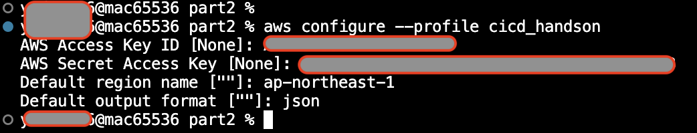

# CodeBuild と AWS CLIでLambdaをデプロイする

## 事前準備

[codebuild_lambda - GitHub](https://github.com/ymd65536/codebuild_lambda.git)をgitコマンドでDesktop上にcloneします。

## IAMユーザーを作成する

part3ディレクトリにある`iam_user.yml`を使ってハンズオンで利用するIAMユーザーを作成します。
※すでにAdministratorAccessで権限を作成されている場合はこの動作は不要です。

`I acknowledge that AWS CloudFormation might create IAM resources with custom names.`にチェックを入れて`Submmit`をクリックします。

問題なくスタックが作成できましたら`Outputs`からアクセスキーとシークレットアクセスきーをコピーします。

### AWS　CLIをにIAMユーザーを記録する

AWS CLIを設定する為に以下のコマンドを実行します。

```sh
aws configure --profile codebuildtest
```

いくつか質問がなされるので順番に回答します。ここで先ほどのアクセスキーとシークレットアクセスキーを利用します。
`AWS Access Key Id`にアクセスキー、`AWS Secret Access Key`にシークレットアクセスキーを入力します。
リージョンはap-northeast-1、出力形式はjsonで問題ありません。



最後に設定されているかどうかを確認する為、`credentials`をチェックします。`[cicd_handson]`という項目が追加されていれば問題ありません。

```sh
cat ~/.aws/credentials 
```

### リポジトリをClone

`codebuild_lambda`リポジトリでターミナルを開きます。

```sh
cd ~/Desktop && git clone https://github.com/ymd65536/codebuild_lambda.git ~/Desktop
```

### 環境変数をセット

```sh
export PROFILE_NAME="codebuildtest"
export AWS_ACCOUNT_ID=`aws sts get-caller-identity --profile $PROFILE_NAME --query 'Account' --output text` && echo $AWS_ACCOUNT_ID
export AWS_DEFAULT_REGION="ap-northeast-1" && echo $AWS_DEFAULT_REGION
export FUNCTION_NAME=lmfunc
export ALIAS_NAME=sample
export ECR_IMAGE_NAME=handson
```

以下のコマンドで`codecommit.yml`をCloudFormationで実行します。

```sh
aws cloudformation deploy --stack-name codecommit --template-file ./codecommit.yml --tags Name=cicdhandson --profile $PROFILE_NAME
```

### ハンズオンで利用するIAM Roleを作成する

今回のハンズオンに必要なIAMロールを作成します。

```sh
aws cloudformation deploy --stack-name codebuild-iam-role --template-file ./codebuild-role.yml --tags Name=cicdhandson --capabilities CAPABILITY_NAMED_IAM --profile $PROFILE_NAME && aws cloudformation deploy --stack-name event-bridge-iam-role --template-file ./event-bridge-iam-role.yml --tags Name=cicdhandson --capabilities CAPABILITY_NAMED_IAM --profile $PROFILE_NAME && aws cloudformation deploy --stack-name pipeline-iam-role --template-file ./pipeline-iam-role.yml --tags Name=cicdhandson --capabilities CAPABILITY_NAMED_IAM --profile $PROFILE_NAME
```

### CodeCommitのリポジトリをクローンする

Desktop上にCodeCommitのリポジトリをcloneします。

```sh
git clone codecommit::ap-northeast-1://$PROFILE_NAME@cicdhandson ~/Desktop && cd ~/Desktop/cicdhandson
```

### mainブランチを作成

```sh
git checkout -b main
```

```sh
echo "Hello Lambda" > README.md
```

```sh
git add .
git commit -m "test1"
git push -u 
```

### lambda_handsonブランチを切る

新しいブランチでビルドを実行する為にCodeBuild用に新しくブランチを切ります。

```sh
git checkout -b lambda_handson
```

### buildspec.yamlを作成する

CodeBuildで利用する設定ファイル(buildspec.yml)を作成します。
part3ディレクトリにあるbuildspec.ymlを`cicd_handson`リポジトリにコピーします。

```sh
cp ~/Desktop/codebuild_lambda/buildspec.yml ~/Desktop/cicdhandson/
```

### dockerfileを作成する

dockerfileを追加します。
`codebuild_lambda`リポジトリに戻り、dockerfileを`cicd_handson`リポジトリにコピーします。

```sh
cp ~/Desktop/codebuild_lambda/dockerfile ~/Desktop/cicdhandson/
```

### app.py　を追加

実行するPythonスクリプトをCodeCommitリポジトリにコピーします。

```sh
cp ~/Desktop/codebuild_lambda/app.py ~/Desktop/cicdhandson/
```

### リモートリポジトリを更新する

CodeCommitのリモートリポジトリにdockerfileをpushします。
リモートリポジトリにブランチを追加します。

```sh
git add .
git commit -m "add files"
git push --set-upstream origin lambda_handson
```

### CodeBuild用 S3バケットの作成

`codebuild_lambda`リポジトリでターミナルを開き、part3にディレクトリを変更します。

```sh
cd ~/Desktop/codebuild_lambda
```

以下のコマンドで`s3.yml`をCloudFormationで実行します。

```sh
aws cloudformation deploy --stack-name s3 --template-file ./s3.yml --tags Name=cicdhandson --profile $PROFILE_NAME
```

### ECRリポジトリの作成

以下のコマンドで`ecr.yml`をCloudFormationで実行します。

```sh
aws cloudformation deploy --stack-name ecr --template-file ./ecr.yml --tags Name=cicdhandson --profile $PROFILE_NAME
```

### CodeBuildのプロジェクトを作成する

CloudFormationでCodeBuildを構築します。
以下のコマンドで`code-build.yml`をCloudFormationで実行します。

```sh
aws cloudformation deploy --stack-name code-build --template-file ./code-build.yml --tags Name=cicdhandson --profile $PROFILE_NAME
```

### CodePipeline の環境構築

CloudFormationでCodePipelineを構築します。
以下のコマンドで`codecommit.yml`をCloudFormationで実行します。

```sh
aws cloudformation deploy --stack-name pipeline --template-file ./pipeline.yml --tags Name=cicdhandson --profile $PROFILE_NAME
```

### プルリクエストを作成する

```sh
aws codecommit create-pull-request --title "new pull request" --description "App Runner ci/cd" --targets repositoryName=cicdhandson,sourceReference=app_runner --profile app_user && PULL_REQUEST_ID=`aws codecommit list-pull-requests --profile app_user --pull-request-status OPEN --repository-name cicdhandson --query 'pullRequestIds' --output text` && echo $PULL_REQUEST_ID && COMMITID=`aws codecommit get-branch --repository-name cicdhandson --branch-name app_runner --profile app_user --query 'branch.commitId' --output text` && echo $COMMITID
```

### ブランチをマージする

以下のコマンドでCodeCommitにpull requestを作成します。

```sh
aws codecommit merge-pull-request-by-fast-forward --pull-request-id $PULL_REQUEST_ID --source-commit-id $COMMITID --repository-name cicdhandson --profile $PROFILE_NAME
```

### Lambdaを関数を作成する

CloudFormationでLambdaを構築します。
以下のコマンドで`lambda.yml`をCloudFormationで実行します。

```sh
aws cloudformation deploy --stack-name lambda --template-file ./lambda.yml --tags Name=cicdhandson --capabilities CAPABILITY_NAMED_IAM --profile $PROFILE_NAME
```

### Lambda　関数のテスト

AWS CLIでLambdaを実行します。

```bash
aws lambda invoke --profile $PROFILE_NAME --function-name $FUNCTION_NAME --invocation-type RequestResponse --region "ap-northeast-1" response.json && cat response.json
```

### 新しいバージョンの関数を作成する

```bash
aws lambda update-function-code --profile $PROFILE_NAME --function-name $FUNCTION_NAME --image-uri "$AWS_ACCOUNT_ID.dkr.ecr.ap-northeast-1.amazonaws.com/cicdhandson:latest" --publish
```

### app.py を修正する

```py
def lambda_handler(event, context):

    return {
        'Hello': 'Test Lambda 2'
    }

```

### エイリアスを作成する

```bash
aws lambda create-alias --profile $PROFILE_NAME --function-name $FUNCTION_NAME --function-version "1" --name deploy
```

### エイリアスを変更する

```bash
aws lambda update-alias --profile $PROFILE_NAME --function-name $FUNCTION_NAME --function-version "2" --name deploy
```

### Lambda　関数のテスト(エイリアスを変更後)

```bash
aws lambda invoke --profile $PROFILE_NAME --function-name "cicdhandsonFunc:deploy" --invocation-type RequestResponse --region "ap-northeast-1" response.json && cat response.json
```

## まとめ
