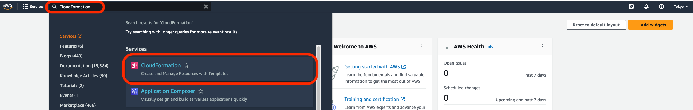
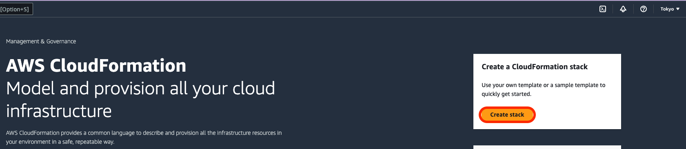
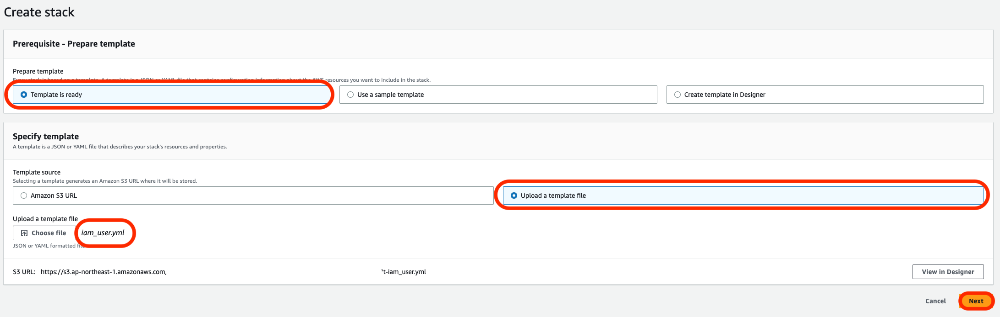
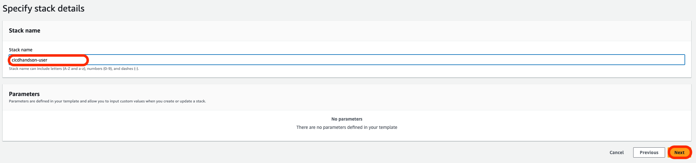
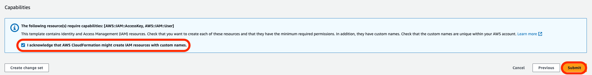
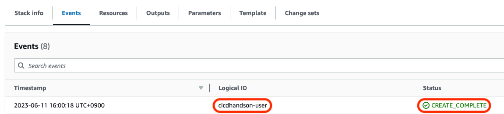
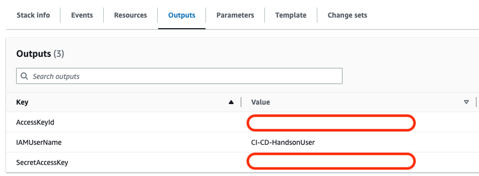

# CodeBuild と AWS CLIでLambdaをデプロイする

## 事前準備

[codebuild_lambda - GitHub](https://github.com/ymd65536/codebuild_lambda.git)をgitコマンドでDesktop上にcloneします。

## IAMユーザーを作成する

codebuild_lambdaにある`iam_user.yml`を使ってハンズオンで利用するIAMユーザーを作成します。
※すでにAdministratorAccessで権限を作成されている場合はこの動作は不要です。

AWSマネジメントコンソールを開き、CloudFormationを検索します。


`create stack`をクリックします。


画面の内容に沿って`iam_user.yml`を指定します。`Next`をクリックします。


`cicdhandson-user`と入力して`Next`をクリックします。


`I acknowledge that AWS CloudFormation might create IAM resources with custom names.`にチェックを入れて`Submmit`をクリックします。


`CREATE_COMPLETE`と表示されましたら問題なくIAMユーザーが作成できています。


問題なくスタックが作成できましたら`Outputs`からアクセスキーとシークレットアクセスキーをコピーします。


## IAM Identity Centerを利用している場合

IAMユーザーを利用しておらず、既にIAM Identity Centerを設定している場合は以下のコマンドを実行することで次の手順に進めます。
`{Profile名}`にはご自分で作成したプロファイル名を指定します。

```sh
aws sso login --profile {Profile名}
```

プロファイル名は`credentials`を調べることでチェックできます。

```sh
cat ~/.aws/credentials 
```

### AWS　CLIをにIAMユーザーを記録する

AWS CLIを設定する為に以下のコマンドを実行します。

```sh
aws configure --profile codebuildtest
```

いくつか質問がなされるので順番に回答します。ここで先ほどのアクセスキーとシークレットアクセスキーを利用します。
`AWS Access Key Id`にアクセスキー、`AWS Secret Access Key`にシークレットアクセスキーを入力します。
リージョンはap-northeast-1、出力形式はjsonで問題ありません。


最後に設定されているかどうかを確認する為、`credentials`をチェックします。`[cicd_handson]`という項目が追加されていれば問題ありません。

```sh
cat ~/.aws/credentials 
```

### リポジトリをClone

`codebuild_lambda`リポジトリでターミナルを開きます。

```sh
cd ~/Desktop && git clone https://github.com/ymd65536/codebuild_lambda.git ~/Desktop
```

### 環境変数をセット

```sh
export PROFILE_NAME=codebuildtest
export AWS_ACCOUNT_ID=`aws sts get-caller-identity --profile $PROFILE_NAME --query 'Account' --output text` && echo $AWS_ACCOUNT_ID
export AWS_DEFAULT_REGION=ap-northeast-1 && echo $AWS_DEFAULT_REGION
export FUNCTION_NAME=cicdhandsonFunc
export ALIAS_NAME=sample
export ECR_IMAGE_NAME=cicdhandson
```

以下のコマンドで`codecommit.yml`をCloudFormationで実行します。

```sh
aws cloudformation deploy --stack-name codecommit --template-file ./codecommit.yml --tags Name=cicdhandson --profile $PROFILE_NAME
```

### CodeCommitのリポジトリをクローンする

Desktop上にCodeCommitのリポジトリをcloneします。

```sh
git clone codecommit::ap-northeast-1://$PROFILE_NAME@cicdhandson ~/Desktop/cicdhandson && cd ~/Desktop/cicdhandson
```

### mainブランチを作成

mainブランチを作成します。

```sh
git checkout -b main
```

READMEを作成してリポジトリにプッシュします。

```sh
echo "Hello Lambda" > README.md
git add .
git commit -m "test1"
git push -u 
```

### lambda_handsonブランチを切る

新しいブランチでビルドを実行する為にCodeBuild用に新しくブランチを切ります。

```sh
git checkout -b lambda_handson
```

### buildspec.yamlを作成する

CodeBuildで利用する設定ファイル(buildspec.yml)を作成します。
part3ディレクトリにあるbuildspec.ymlを`cicd_handson`リポジトリにコピーします。

```sh
cp ~/Desktop/codebuild_lambda/buildspec.yml ~/Desktop/cicdhandson/
```

### dockerfileを作成する

dockerfileを追加します。
`codebuild_lambda`リポジトリに戻り、dockerfileを`cicd_handson`リポジトリにコピーします。

```sh
cp ~/Desktop/codebuild_lambda/dockerfile ~/Desktop/cicdhandson/
```

### app.py　を追加

実行するPythonスクリプトをCodeCommitリポジトリにコピーします。

```sh
cp ~/Desktop/codebuild_lambda/app.py ~/Desktop/cicdhandson/
```

### リモートリポジトリを更新する

CodeCommitのリモートリポジトリにdockerfileをpushします。
リモートリポジトリにブランチを追加します。

```sh
git add .
git commit -m "add files"
git push --set-upstream origin lambda_handson
```

### CodeBuild用 S3バケットの作成

`codebuild_lambda`リポジトリでターミナルを開きます。

```sh
cd ~/Desktop/codebuild_lambda
```

以下のコマンドで`s3.yml`をCloudFormationで実行します。

```sh
aws cloudformation deploy --stack-name s3 --template-file ./s3.yml --tags Name=cicdhandson --profile $PROFILE_NAME
```

### ECRリポジトリの作成

以下のコマンドで`ecr.yml`をCloudFormationで実行します。

```sh
aws cloudformation deploy --stack-name ecr --template-file ./ecr.yml --tags Name=cicdhandson --profile $PROFILE_NAME
```

### ハンズオンで利用するIAM Roleを作成する

今回のハンズオンに必要なIAMロールを作成します。

```sh
aws cloudformation deploy --stack-name codebuild-iam-role --template-file ./codebuild-role.yml --tags Name=cicdhandson --capabilities CAPABILITY_NAMED_IAM --profile $PROFILE_NAME && aws cloudformation deploy --stack-name event-bridge-iam-role --template-file ./event-bridge-iam-role.yml --tags Name=cicdhandson --capabilities CAPABILITY_NAMED_IAM --profile $PROFILE_NAME && aws cloudformation deploy --stack-name pipeline-iam-role --template-file ./pipeline-iam-role.yml --tags Name=cicdhandson --capabilities CAPABILITY_NAMED_IAM --profile $PROFILE_NAME
```

### CodeBuildのプロジェクトを作成する

CloudFormationでCodeBuildを構築します。
以下のコマンドで`code-build.yml`をCloudFormationで実行します。

```sh
aws cloudformation deploy --stack-name code-build --template-file ./code-build.yml --tags Name=cicdhandson --profile $PROFILE_NAME
```

### CodePipeline の環境構築

CloudFormationでCodePipelineを構築します。
以下のコマンドで`codecommit.yml`をCloudFormationで実行します。

```sh
aws cloudformation deploy --stack-name pipeline --template-file ./pipeline.yml --tags Name=cicdhandson --profile $PROFILE_NAME
```

### プルリクエストを作成する

CodeCommitのリポジトリに対してプルリクエストを作成します。

```sh
aws codecommit create-pull-request --title "new pull request" --description "App Runner ci/cd" --targets repositoryName=cicdhandson,sourceReference=lambda_handson --profile $PROFILE_NAME && PULL_REQUEST_ID=`aws codecommit list-pull-requests --profile $PROFILE_NAME --pull-request-status OPEN --repository-name cicdhandson --query 'pullRequestIds' --output text` && echo $PULL_REQUEST_ID && COMMITID=`aws codecommit get-branch --repository-name cicdhandson --branch-name lambda_handson --profile $PROFILE_NAME --query 'branch.commitId' --output text` && echo $COMMITID
```

### ブランチをマージする

以下のコマンドでCodeCommitにpull requestを作成します。

```sh
aws codecommit merge-pull-request-by-fast-forward --pull-request-id $PULL_REQUEST_ID --source-commit-id $COMMITID --repository-name cicdhandson --profile $PROFILE_NAME
```

### ビルドされたイメージを確認する

CodeBuildによってECRにpushされたイメージを確認します。

```sh
aws ecr list-images --profile $PROFILE_NAME --repository-name cicdhandson --query "imageIds[*].imageDigest" --output table
```

### Lambdaを関数を作成する

CloudFormationでLambdaを構築します。
以下のコマンドで`lambda.yml`をCloudFormationで実行します。

```sh
aws cloudformation deploy --stack-name lambda --template-file ./lambda.yml --tags Name=cicdhandson --capabilities CAPABILITY_NAMED_IAM --profile $PROFILE_NAME
```

### Lambda　関数のテスト

AWS CLIでLambdaを実行します。

```bash
aws lambda invoke --profile $PROFILE_NAME --function-name $FUNCTION_NAME --invocation-type RequestResponse --region "ap-northeast-1" response.json && cat response.json
```

実行結果

```text
{
    "StatusCode": 200,
    "ExecutedVersion": "$LATEST"
}
{"Hello": "Test Lambda"}
```

### 新しいバージョンの関数を作成する

指定のLambda関数でで新しいバージョンを発行します。

```bash
aws lambda update-function-code --profile $PROFILE_NAME --function-name $FUNCTION_NAME --image-uri "$AWS_ACCOUNT_ID.dkr.ecr.ap-northeast-1.amazonaws.com/${ECR_IMAGE_NAME}:latest" --publish --query "Version"
```

以下のようにバージョン番号が表示されます。

```text
10
```

### app.py を修正する

CodeCommitのリポジトリを開きます。

```sh
cd ~/Desktop/cicdhandson/
```

```py
def lambda_handler(event, context):

    return {
        'Hello': 'Test Lambda 2'
    }

```

### リモートリポジトリを更新する(2回目)

CodeCommitのリモートリポジトリにdockerfileをpushします。
リモートリポジトリにブランチを追加します。

```sh
git add .
git commit -m "Test Lambda 2"
git push
```

### エイリアスを作成する

`codebuild_lambda` リポジトリのディレクトリに変更します。

```sh
cd ~/Desktop/codebuild_lambda
```

新しいエイリアスを作成します。

```bash
aws lambda create-alias --profile $PROFILE_NAME --function-name $FUNCTION_NAME --function-version "10" --name deploy
```

実行結果

```sh
{
    "AliasArn": "arn:aws:lambda:ap-northeast-1:$AWS_ACCCOUNTID:function:cicdhandsonFunc:deploy",
    "Name": "deploy",
    "FunctionVersion": "10",
    "Description": "",
    "RevisionId": "4bca3c58-5925-457a-861d-16c2c3230e3a"
}
```

### プルリクエストを作成する(2回目)

CodeCommitのリポジトリに対してプルリクエストを作成します。

```sh
aws codecommit create-pull-request --title "new pull request" --description "App Runner ci/cd" --targets repositoryName=cicdhandson,sourceReference=lambda_handson --profile $PROFILE_NAME && PULL_REQUEST_ID=`aws codecommit list-pull-requests --profile $PROFILE_NAME --pull-request-status OPEN --repository-name cicdhandson --query 'pullRequestIds' --output text` && echo $PULL_REQUEST_ID && COMMITID=`aws codecommit get-branch --repository-name cicdhandson --branch-name lambda_handson --profile $PROFILE_NAME --query 'branch.commitId' --output text` && echo $COMMITID
```

### ブランチをマージする(2回目)

以下のコマンドでCodeCommitにpull requestを作成します。

```sh
aws codecommit merge-pull-request-by-fast-forward --pull-request-id $PULL_REQUEST_ID --source-commit-id $COMMITID --repository-name cicdhandson --profile $PROFILE_NAME
```

### 新しいバージョンの関数を作成する(2回目)

指定のLambda関数でで新しいバージョンを発行します。

```bash
aws lambda update-function-code --profile $PROFILE_NAME --function-name $FUNCTION_NAME --image-uri "$AWS_ACCOUNT_ID.dkr.ecr.ap-northeast-1.amazonaws.com/${ECR_IMAGE_NAME}:latest" --publish --query "Version"
```

以下のようにバージョン番号が表示されます。

```text
11
```

### エイリアスを変更する

新しい関数エイリアスを作成します。

```bash
aws lambda update-alias --profile $PROFILE_NAME --function-name $FUNCTION_NAME --function-version "11" --name deploy
```

実行結果

```json
{
    "AliasArn": "arn:aws:lambda:ap-northeast-1:$AWS_ACCOUNTID:function:cicdhandsonFunc:deploy",
    "Name": "deploy",
    "FunctionVersion": "11",
    "Description": "",
    "RevisionId": "db1e2f5d-36da-42ff-b16b-5fdc5f905e8a"
}
```

### Lambda　関数のテスト(エイリアスを変更後)

以下のコマンドでLambda関数を実行します。

```bash
aws lambda invoke --profile $PROFILE_NAME --function-name "$FUNCTION_NAME:deploy" --invocation-type RequestResponse --region "ap-northeast-1" response.json && cat response.json
```

実行結果

```json
{
    "StatusCode": 200,
    "ExecutedVersion": "11"
}
{"Hello": "Test Lambda 2"}
```

結果が`{"Hello": "Test Lambda 2"}`となりましたら成功です。

## まとめ

CodeBuildを使ってLambda用のコンテナイメージをビルドし、AWS CLIでLambda関数をデプロイできました。
しかし、実務においてこれだけコマンドを打つと作業ミスが発生するのは容易に想像がつくと思います。

今回は紹介できませんでしたが、AWSにサーバーレスのアプリケーションモデルをすぐにデプロイする為のフレームワーク
AWS Serverless Application Model (AWS SAM)が存在します。次はAWS SAMについてハンズオンを書いていけたらと思います。
